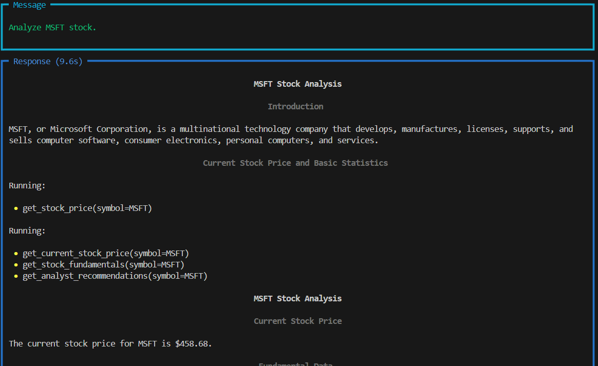
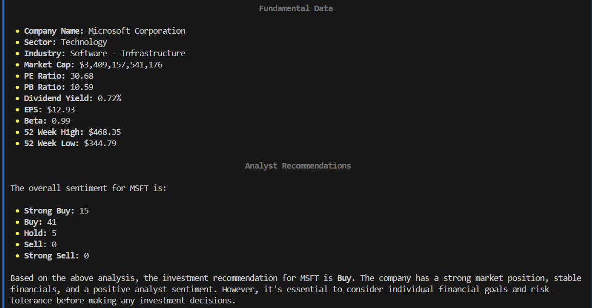

# Finance-Agent
# 💰 Finance Assistant Agent 🤖

An intelligent finance agent built using the [Phi framework](https://github.com/Significant-Gravitas/phi) and GROQ API. This agent uses real-time market data, investment research tools, and search capabilities to give instant financial insights.

---

## 🔍 What It Can Do

- ✅ Query real-time financial data using Yahoo Finance
- 📊 Run investment research via OpenBB
- 🔎 Use Google Search to find latest market news
- ⚡️ Powered by GROQ LLM for lightning-fast performance
- 🧠 Built on the modular agentic AI structure from Phi-Data

---
## 📸 Screenshots

